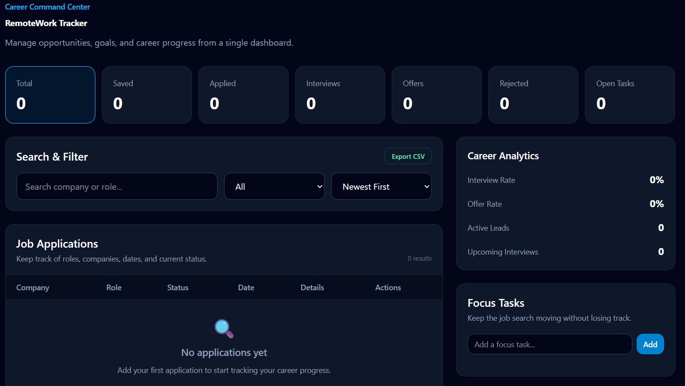
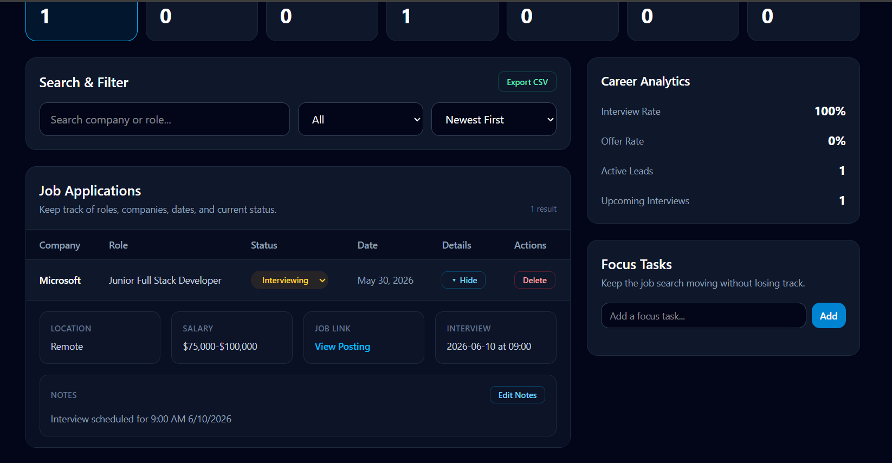
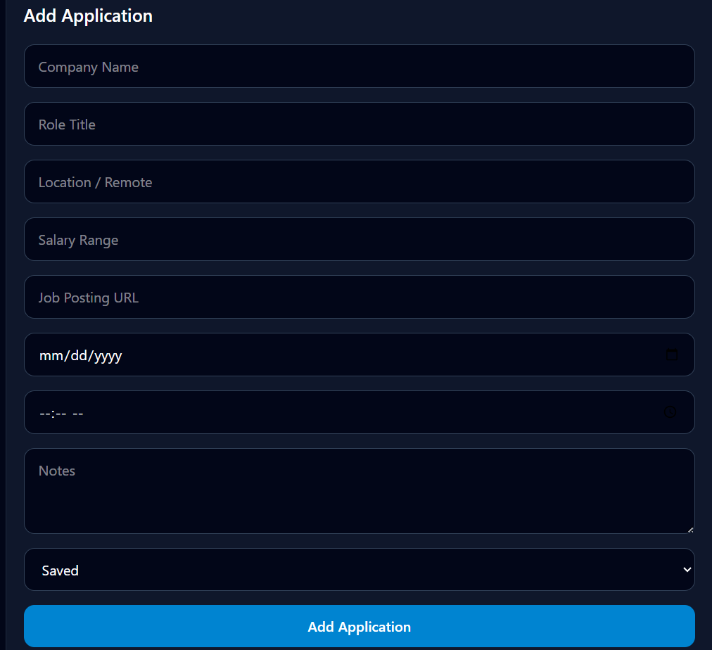
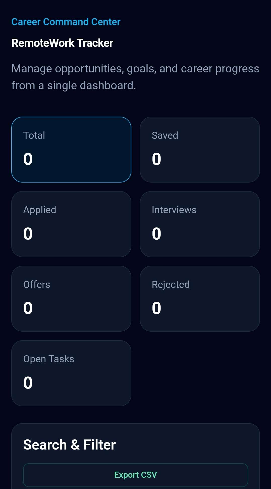

# Career Command Center

Career Command Center is a centralized job-search management dashboard built with React and Tailwind CSS. Users can track applications, schedule interviews, manage career tasks, analyze job-search performance, and export application data from a single responsive interface.

## Technologies Used

- React
- JavaScript (ES6+)
- Vite
- Tailwind CSS
- Browser Local Storage API

## Live Demo

https://remote-work-tracker-pi.vercel.app/


## Repository

https://github.com/Evans-Steven/remote-work-tracker

## Screenshots

### Dashboard Overview



### Application Tracking & Interview Management



### Add Application Workflow



### Mobile Responsive Design



## Project Highlights

- Built and deployed a complete React application
- Designed a responsive dashboard interface
- Implemented full CRUD functionality
- Added local storage persistence
- Created search, filtering, and sorting systems
- Built interview tracking and career analytics features

## Features

### Application Tracking

- Create and delete applications
- Update application status
- Store notes for each application
- Track interview dates and times
- View expanded application details

### Career Analytics

- Total applications
- Interview rate
- Offer rate
- Active leads
- Upcoming interviews

### Search & Organization

- Search by company or role
- Filter by status
- Sort applications
  - Newest First
  - Oldest First
  - Company A–Z
  - Company Z–A
  - Status

### Task Management

- Create tasks
- Edit tasks
- Complete tasks
- Delete tasks

### Data Management

- Local storage persistence
- CSV export
- Empty state handling

## What I Learned

This project helped me strengthen my understanding of:

- React state management
- Component architecture
- CRUD operations
- Local storage persistence
- Conditional rendering
- Search and filtering
- Data sorting
- Responsive dashboard design
- Debugging React applications

## Future Improvements

- User authentication
- Cloud database integration
- Multi-device synchronization
- Calendar integration
- Interview reminders

## Installation

```bash
git clone https://github.com/Evans-Steven/remote-work-tracker.git
cd remote-work-tracker
npm install
npm run dev
```

## Author

Built by Steven Evans